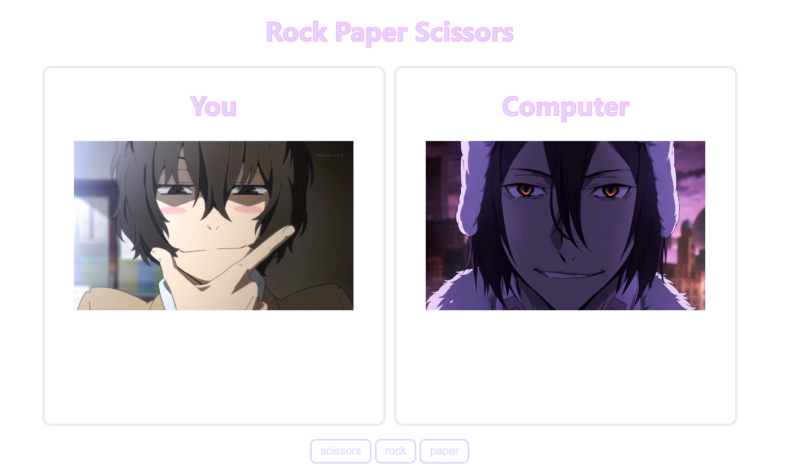
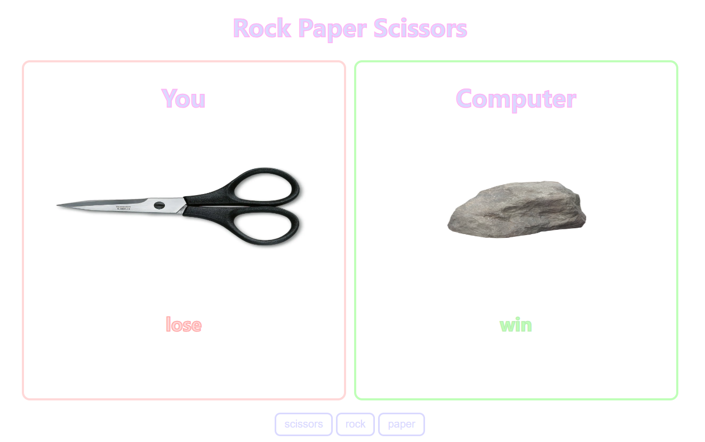
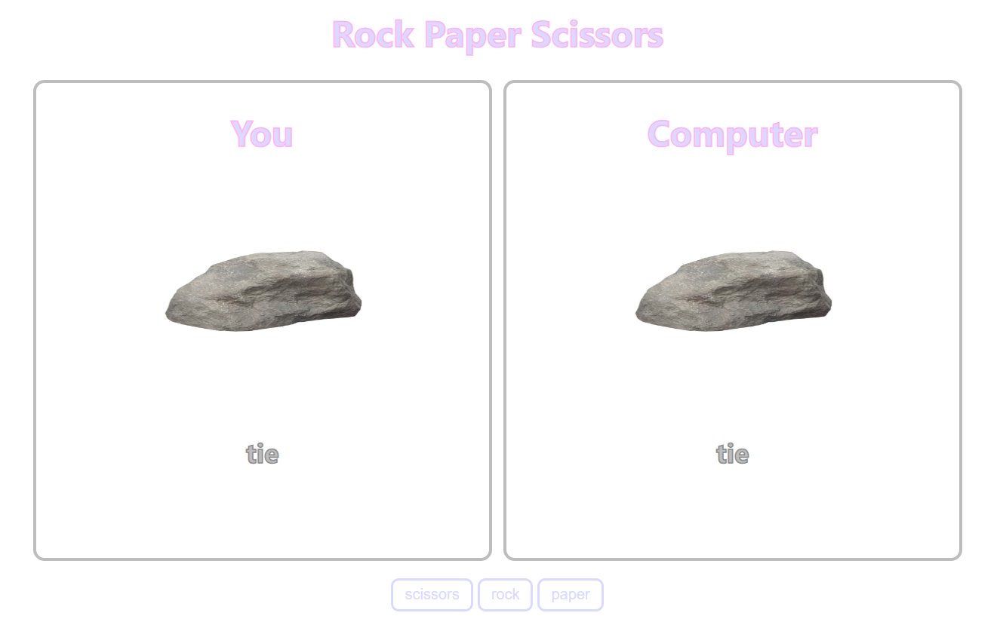
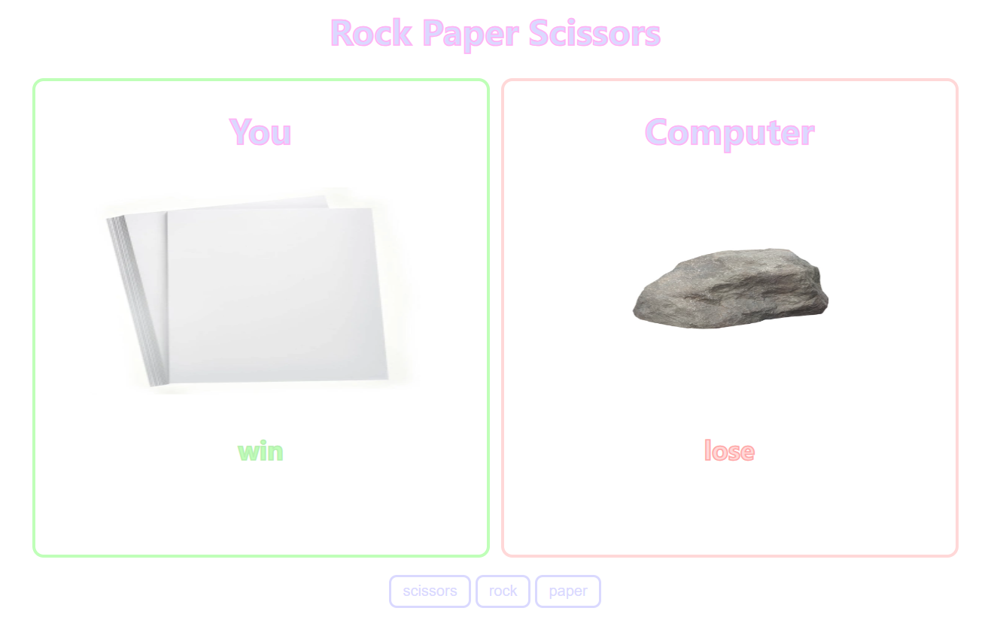

# [react] 가위 바위 보 게임

사용자와 컴퓨터가 `가위바위보 게임`을 하는 `토이 프로젝트`입니다.  
사용자는 `가위, 바위, 보` 중 한 가지의 버튼을 누를 수 있습니다.  
사용자가 버튼을 누르면, 컴퓨터는 `랜덤`으로 가위, 바위, 보 중 하나를 선택합니다.  
사용자와 컴퓨터의 `승패 결과`를 보여줍니다.  

### `초기 화면`

게임 시작 전 초기 화면입니다.
### `게임 진행 화면`

사용자가 지고, 컴퓨터가 이겼습니다.

사용자와 컴퓨터가 비겼습니다.

사용자가 이기고, 컴퓨터가 졌습니다.

### etc

velog: https://velog.io/@annann0718/%EA%B0%80%EC%9C%84%EB%B0%94%EC%9C%84%EB%B3%B4-%EA%B2%8C%EC%9E%84